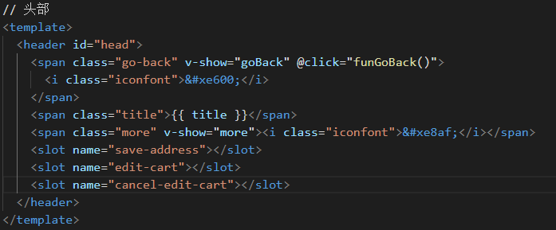
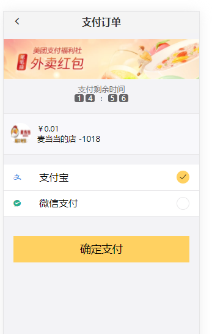

- main.js用作全局配置，也是打包的入口
- router 下的 index.js 是全局的路由配置
- APP.vue 是根组件 只需要一个路由占位符即可
- 在 components 目录下写各个组件
- assets 下存放静态资源 包括 global.css
- 创建一个vue.config.js配置一些webpack属性

##  食堂外卖项目
### 1 首页
### 1.1 首页头部组件
	其主要的布局分为三部分：
	左边：其主要功能是返回上一级路由或者实现路由跳转至首页，
	中部：显示当前页面下的标题，
	右边：主要是更多按钮，但是我们要使该部分是动态的，就是依据页面不同，该部分所使用的不同。
	
<b>右侧解决办法是：在head.vue组件内部使用具名插槽</b>
具体如下：在该组件中有三个具名插槽，
.save-address是用来地址页面保存地址。
.edit-cart是用来购物车页面编辑购物车
.cancel-edit-cart是用来购物车页面编辑购物车

使用如下：
head.vue是公共组件，在多个页面中都有使用，那么在使用中，
有两种使用方式：
	<ol>
	<li>
	<div>在使用head.vue组件的父组件中引入，即在父组件的script标签内注册子组件。</div>
	<div>
		<div>import vHead from "./components/head.vue"</div>
		<div>export default{</div>
			<div>components{</div>
				<div>vHead:vHead,//(等同于vHead，这是es6的写法)</div>
			<div>}</div>
		<div>}</div>
		</li>
	<li>
	<div>全局注册子组件，那么使用过程中就不需要一个个的注册，</div>
	<div>在main.js中(本人采用方法二)</div>
	<div>`import vHead from "./components/head.vue"`</div>
	<div>Vue.component('v-head',vHead)</div>
	</li>
比如在父组件cart.vue中使用子组件head.vue


### 1.2 iconfont的使用 
	<div>优势劣势</div>
	<div><b>优势</b></div>
	<ol>
	<li>轻量级:字体图标比一系列的图片要小，且不需要像图片那样去请求下载下来，一旦字体加载，字体图标就会加载，可以减少http的请求次数</li>
	<li>灵活性：字体图标可以像页面中的字体那样，不仅可以设置font-size大小，还可以设置color、text-decoration、hover、text-shadow</li>
	<li>兼容性：字体图标可以兼容各种浏览器，甚至低版本的IE浏览器都兼容</li>
	<li>字体图标不会出现像图片放大那样的失真</li>
	</ol>
	<p><b>劣势</b></p>
	<ol>
	<li>字体图标只能渲染成单色、或者css3的渐变色</li>
	<li>字体图标库会有些版权限制</li>
	<li>自己去创作字体图标是很耗时间的，重构人员的后期维护也很大</li>
	</ol>
	在本项目中主要使用阿里巴巴矢量字体图标库
	相似的字体库还有：
	<ol>
	<li>icon-material design:google设计团队出品</li>
	<li>font awesome</li>
	</ol>
	阿里巴巴矢量字体图标库使用
	<ol>
		<li>1、注册一个账号</li>
		<li>将要使用的字体图标搜索并加载到购物车中，并将购物车中的字体图标，添加至项目中。</li>
		<li>分三种使用方式 unicode 、fontclass、symbol</li>
		<li>在公共样式文件中声明iconfont</li>
		组件中使用
		<i class="iconfont icon-xiangxia"></i>
		<i class="iconfont">&#xebe6;</i>
	</ol>

- 「&#」的意思，「&#」 开头的是HTML实体。所有 html 显示的内容，都可以通过 &# 的形式表述。例如，汉字的HTML实体由三部分组成，`&#(中文对应ASCII码);`。例如，把“最新” 转换成“&#26368;&#26032;”
- 为什么中英文能直接显示，不需要使用「&#」形式表示呢？因为中英文有 ASCII 进行自动转义。而 iconfont 不在 ASCII 中定义。是自定义的。
- iconfont 相当于使用了剩余的 unicode 编码，将自定义的图标描述通过 &# 开头的 HTML 实体的形式表现出来。
- 以「&#」开头的后接十进制数字，以「&#\x」开头的后接十六进制数字

### 1.3 移动端字体的适配
#### 1.3.1 原因
-	在PC端，一个逻辑像素等于一个物理像素，不存在图片字体过小的问题。
-	在移动端，以iphone6为例，它的逻辑分辨率是375*667,物理分辨率是750*1400,即一个逻辑像素=2个物理像素。
-	如果不做适配，会出现什么问题呢，会出现在电脑端1px还是1px的大小,但是在移动端就会出现1px会是电脑端2px的大小。也就是说会被放大，这不是我们想要的
#### 1.3.2 三个视口
- 布局视口:布局视口是前端工作人员页面布局的大小，远大于手机屏幕的大小，此时会出现滚动条，默认是980px。
- 视觉视口:视觉视口是用户正在看到的网页区域，当用户进行缩小，视觉视口会变大，当用户进行放大，视觉视口会变小。
- 理想视口：是网页布局的一个理想视口，就是使布局视口等于手机逻辑分辨率的值，此时视觉视口也会等于屏幕尺寸的大小。

#### 1.3.3 设置
	`<meta name="view-port" content="width=device-width" initial-scale=1.0">`
#### 1.3.4 适配方案
	在iphone6中，此时1逻辑像素=2个物理像素，设计稿是依据750来设计的，那么设计稿中的一像素就等于0.5逻辑像素。
#####	1.3.4.1 媒体查询+rem
	依据不同的屏幕尺寸设置不同根元素html的font-size的大小。在后面的布局中依据根元素font-size的大小进行布局，采用rem单位。
	假设设计稿是750px
	我们把整个屏幕划分为15等分（可以根据自己的需求划分等分） 750px/15 = 50 一份为50px
	那么在逻辑分辨率为375设备的时候，字体大小为375px/15就是25px;
	元素大小取值方法
	最后的公式：页面元素的rem值 = 页面元素的值（px）/(屏幕宽度/划分的份数)
	屏幕宽度/划分的份数 就是html font-size 的大小
	或者：页面元素的rem值 = 页面元素值（px）/html font-size字体大小
#####	 1.3.4.2 淘宝方案
	我们可以采用 rem 为单位设置元素大小。对于不同屏幕，我们只需要动态修改根元素字体大小，元素大小就会同比例改变，从而做到页面的自动适配效果。例如，假设设计稿宽度为 750px，元素A宽度为 300px，在屏幕宽度为 375pt 的屏幕中，设置根元素字体大小为 75px，则元素A宽度为 4rem；在屏幕宽度为 750pt 的屏幕中，只需将根元素字体大小改为 150px，不需要改变元素A的大小，就可以做到页面适配。
	与媒体查询不同的是动态的修改font-size的大小。而媒体查询是根据屏幕尺寸的大小去确定不同的font-size的大小。
	在淘宝方案中，1rem = clientWidth/10;
######	总结一下，使用动态 rem 方案需要做的工作：
- meta 标签设置 viewport 宽度为屏幕宽度；
- 根据不同屏幕修改根元素 font-size 大小，一般设置为屏幕宽度的十分之一（可引入 lib-flexible 库，或者自己写相应逻辑）；
- 开发环境配置 postcss-px2rem 或者类似插件；
- 根据设计稿写样式，元素宽高直接取设计稿宽高即可，单位为 px，插件会将其转换为 rem；
- 段落文本也按照设计稿写，单位为px，不需要转换为 rem；

#####	1.3.4.3 viewport方案
	上面介绍的动态rem方案，其本质是让页面元素大小跟随屏幕宽度的变化比例缩放。CSS Viewport units(视口单位)正是一种相对于屏幕宽高的一种长度单位，并且兼容性越来越好。视口单位有: vw、vh、vmin 和vmax。vw单位便是根元素宽度的百分比，1vw等于视口宽度的1%。
###### vw 适配方案的流程：
	meta 标签设置 viewport 宽度为屏幕宽度；
	开发环境配置 postcss-px-to-viewport 或者类似插件；
	根据设计稿写样式，元素宽高直接取设计稿宽高即可，单位为 px，插件会将其转换为 vw；
	段落文本也按照设计稿写，单位为px，不需要转换为 vw;
### 1.4 定位的使用
	定位使用的是腾讯位置服务，其原理是通过根据ip地址进行定位，
	接口是'https://apis.map.qq.com/ws/location/v1/ip'。
	但是该接口有一个缺点是只能访问到市级别，比如：湖南省邵阳市。
	但是我们的需求是要定位到具体的位置，比如：龙湖世纪一期一栋。此时需要第二个接口：'https://apis.map.qq.com/ws/geocoder/v1/'。除了能定位以外，还能进行搜索，此时访问第三个接口:'http://apis.map.qq.com/ws/place/v1/suggestion'
	在腾讯位置服务官网中，
	- 先注册账号，
	- 再创建一个我的应用，
	- 获取自己电脑网络的ip地址
	- 按照图下所示配置，将自己的ip地址配置到"授权ip"里去
 获取当前定位: 

在后端中：
	（1）创建config.js，这个里面放置的是一些配置，将腾讯位置服务我的应用中，对应的密钥复制到config.js文件对应位置。
	
	（2）后端中写对应的发起请求的逻辑,第一步是根据ip得到省会城市，
	
	第二步根据省城市获取具体的位置
	
在前端：调用接口，获取定位信息
	
位置搜索
后端：
	
前端：
	

### 1.5 首页导航组件实现
该组件使用mint-ui组件，实现轮播，mint-ui组件一般用来实现轮播

效果：


### 1.6 首页所有商家组件实现
商家显示不是一次性全部显示，而是上拉加载，才加载剩下的商家，实现分页加载的效果。
	要实现上拉加载的效果，要借助better-scroll组件，该组件使用方式是：
	要先安装该组件，并将该组件引入需要的组件中去，
	`import BScroll from "better-scroll";`
	滚轮有内外两层，只有当内层元素的高度大于或等于外层元素高度时才会触发。

	所以在设置内外层容器高度时，外层容器设置为屏幕逻辑分辨率大小，内层容器设置为由内容撑开。index是外层容器的类名。
	`.index {height: 100%;	}`
	(1)第一个问题：怎么解决代表往上拉
	当当前首页上的商家不满足用户需求时，需要查看更多的商家，此时上拉加载，发起一次请求，去获取商家，那怎么判断是上拉了呢，就需要使用到下面的原理：
	当滚轮往上滚了的高度（y）+外层容器的高度（也即屏幕逻辑分辨率中代表高的那个值大小,外层.clientHeight）>=内层盒子的高度(内层.clientHeight);这样就代表了往上拉了
	(2)上面的方法虽然解决了往上拉加载商家的问题，但是当用户不停的网上拉，这样的话就会一直触发请求，会导致资源的浪费和请求过于频繁，怎么解决多次触发请求
	解决方法：使用一个loading标签，如果为真代表已经请求了就不再再一次的去请求。
	
	(3) 加载动画实现
	动画的实现：通过伪元素在loading前面添加一个元素，其大小为长为2px、宽为2px,通过border-radius:100%设置为圆，此圆没有边框，通过box-shadow设置水平、垂直偏移量 和阴影的大小、颜色就设置成一个静态的加载图，再通过动画animation使其动起来，就达到了效果。
```
 @mixin loading{
  background-color:#fff;
  text-align:center;
  font-size:14px;
  height:26px;
  line-height:26px;
  .loading:before{
    content:"";
    display:inline-block;
    position:relative;
    left:-11px;
    top:-4px;
    padding:0;
    border:0;
    background:0;
    width:2px;
    height:2px;
    border-radius:100%;
    box-shadow: 0 -7px 0 0.9px #666,7px 0 0 0.1px #999,-7px 0  0 0.5px #999,0 7px #999, -5px 5px 0 0.3px #999,5px 5px #999,5px -5px #999,-5px -5px  0 0.7px #999;
    animation: spin 1s linear infinite;
    -webkit-animation: spin 1s linear infinite;
  }
	  @keyframes spin {
    from {
      transform: rotate(0deg)
    }
    to {
      transform: rotate(360deg)
    }
  }
```

### 1.7 具体商家的商品信息展示

如图所示


#### 头部商家名称展示
该部分通过head.vue组件这个公共组件进行展示。
```<v-head :title="poi_info.name" goBack="true" color="#fff" bgColor="#333" more="true"></v-head>```

#### 头部商家信息展示
该部分就是将商家信息按照一定的布局展示
```     <div class="store-info">
        <div class="logo">
				<!-- 商家图片 -->
          
        </div>
				<!-- 商家的配送信息 -->
        <div class="deliver-info">
          <span>{{poi_info.min_price_tip}}  | {{poi_info.shipping_fee_tip}} | {{poi_info.delivery_time_tip}}</span>
          <p><i class="iconfont icon-broadcast">&#xe62d;</i>{{poi_info.bulletin}}</p>
        </div>
      </div>
```

#### 点菜组件
该组件主要分为两个部分左侧商品分类部分，和右侧分类商品部分
##### 左侧部分：
html:
```
    <div class="left" ref="left">
      <ul>
        <li v-for="(category,index) in foodsData" :key="category.id" @click="mappingScroll(index)"
            :class="{'activity-menu': index == menuIndex}">
          {{category.name}}
        </li>
      </ul>
    </div>
```
该部分主要是显示分类的名称，及当选择某个分类时，右侧跳转到对应的分类下，即上面的mappingScroll方法。但是如何实现。
解决方法：
- 拿到右侧分类商品名称的位置。
    - 那么在点菜组件渲染完成，我们就在钩子函数created中去获取右侧分类商品名称的位置数组categoryPosition。
    - 怎么拿到位置呢，我们知道一个盒子容器它是有宽高的，那么我们可以拿到一个盒子距离页面顶部的高度,即可以通过offsetTop拿到
     ```
   	created() {
      this.windowHeight = window.innerHeight;       //设备显示高度
      let restaurant_id = this.$route.query.id;
      //根据餐馆id获取食物
      getFoods({restaurant_id}).then((response) => {
        this.foodsData = response.data.data;
        this.getInfoReady = true;
        this.$nextTick(() => {       //初始化better-scroll
          this.leftScroll = new BScroll(this.$refs.left, {click: true});
          this.rightScroll = new BScroll(this.$refs.right, {click: true, probeType: 3,});
          let dom = (this.$refs.right.children)[0];   //确定各分类categoryPosition
          let listsArr = Array.from(dom.childNodes);
          listsArr.forEach((item, index) => {
            this.categoryPosition[index] = item.offsetTop;
          });
          this.listenScroll();    //监听滚动
          this.lazyLoadImg(0);  //第一个分类首先加载图片  其它监听活动时懒加载
        })
      })
    },
  ```
- 点击分类跳转，那么实现方法就是点击某个分类，滚轮向上移动一定的距离,```this.rightScroll.scrollTo(0, -this.categoryPosition[index], 500);```
	```
	      mappingScroll(index) {    //点击左侧  右侧滚动到对应的位置
        this.rightScroll.off('scroll', this.mappingScrolli)
        this.rightScroll.scrollTo(0, -this.categoryPosition[index], 500);
        this.menuIndex = index;
        this.lazyLoadImg(index);
        setTimeout(this.listenScroll, 500);
      },
	```

#### 右侧部分:

右侧主要是分类商品的展示，以及右侧滚动，判断左侧处于哪个分类
categoryPosition是分类数组,i是下标。
判断方法是:遍历categoryPosition数组,
- 当不是最后一个分类时：获取滚轮滚动的位置pos.y,如果下一个(i+1)的分类位置categoryPosition[i+1]大于滚轮滚动的位置pos.y，就代表滚轮滚动到上一个分类categoryPosition[i]，那我们就使menuIndex=i，使左侧对应的分类背景色变色。
- 当是最后一个分类时，即i=categoryPosiiton.length-1时，当最后一个分类的位置小于等于滚动的位置的绝对值时，那我们就使menuIndex=i，使左侧对应的分类背景色变色。

``` 
	mappingScrolli(pos) {   //右侧滚动时  判断当前左侧是第几个分类
        for (let i = 0; i < this.categoryPosition.length; i++) {
          if (this.categoryPosition[i] <= Math.ceil(Math.abs(pos.y)) && i === this.categoryPosition.length - 1 || this.categoryPosition[i + 1] > Math.ceil(Math.abs(pos.y))) {
            this.menuIndex = i;
            this.lazyLoadImg(i);
            this.lazyLoadImg(i + 1);  //下一页提前加载
            break;
          }
        }
      },
```
#### 选择器组件

添加商品按钮、减少商品数量按钮、添加同类商品的数量显示,默认只显示添加按钮、控制减少商品数量按钮和数量显示，通过商品数量是否大于0来控制显示与不显示

```  
<div id="selector">
    <div class="ball-container" @click="reduceCart" v-if="food_num">
      <span class="reduce"><i class="iconfont icon-reduce">&#xe613;</i></span>
    </div>
    <span class="number" v-if="food_num">{{food_num}}</span>
    <div class="ball-container" @click="addCart($event)">
      <span class="add"><i class="iconfont icon-add">&#xe6a9;</i></span>
    </div>
  </div>
```
##### 添加商品按钮addCart()
添加商品那么需要将商品对应的商家图片和商家的名称、商品的图片、商品的名称、价格添加至购物车中，怎么代表添加至购物车中，就是发起一个异步请求，数量在全局状态管理中加一
```
      addCart(event) {
        let elRight = event.target.getBoundingClientRect().right; //选择器的右边 离左边页面的位置
        let elBottom = event.target.getBoundingClientRect().bottom;   //选择器的底部  离顶部页面的位置
        let {pic_url} = this.poi_info;   //商店名字 图片
        let restaurant_name = this.poi_info.name;
        this.$store.dispatch('addCart', {
          restaurant_name,
          pic_url,
          name: this.name,
          price: this.price,
          foods_pic: this.pic,
          food_id: this.food_id,
          restaurant_id: this.poi_info.id,
        });
        this.$emit('showDot', elRight, elBottom);
      },
```
全局状态管理中:


##### 删除商品按钮reduceCart()
该实现思路与addCart()思路是一致的。

##### 小球进入购物车的效果
小球进入购物车的效果是一个抛物的效果，
实现这样的效果：通过vue中的transition组件实现，

```
<transition appear
                @after-appear='afterEnter'
                @before-appear="beforeEnter" v-for="(ball,index) in balls" :key="index">
      <div class="balls" ref="balls" v-if="ball">
        <span class="ball"></span>
      </div>
</transition>
```
要实现小球是抛物的效果：
要按两步走：
- 第一步是:将小球移动、移动到触发添加购物车按钮旁边。具体实现如下：
  - 获取当前点击加按钮在网页中的绝对right值elRight，
  - 获取当前点击加按钮在网页中的绝对bottom值elBottom,
  - 这两个值的获取:通过在选择器组件中通过getBoundingClientRect()[getBoundingClientRect用于获得页面中某个元素的左，上，右和下分别相对浏览器视窗的位置。]
  let elRight = event.target.getBoundingClientRect().right; //选择器的右边 离左边页面的位置
  let elBottom = event.target.getBoundingClientRect().bottom;   //选择器的底部  离顶部页面的位置
  - 选择器组件中获取的elRight和elBottom值，通过子组件向父组件传值的办法传给父组件(emit('showDotFun',elRight,elBottom))，拿到这两个值后，将小球ball移动到当前点击加按钮附近
  
- 第二步:让小球做抛物线运动
  - 要让小球做抛物线运动，在动画transition中是没有专门的抛物线函数的,所以要让小球在水平方向在匀速直线运动，在垂直方向上做曲线运动。
  - 要让小球移到购物车的位置。
  
##### 购物车晃动的效果
购物车的晃动效果通过动画实现，
解决方法：给span元素添加ballInCart类，小球进入就添加该类，当小球进入的动作完成就去除该类。
html:ballInCart就是商品小球进入购物车类

css：
```
  &.ballInCart {
        animation: move .5s ease-in-out;
      }
  @keyframes move {
    0% {
      transform: scale(1)
    }
    25% {
      transform: scale(1.1)
    }
    50% {
      transform: scale(1.2)
    }
    75% {
      transform: scale(1.1)
    }
    100% {
      transform: scale(1)
    }
```


#### 评价组件
展示商家的的评价


##### 评价的头部
主要是展示商家的评分、口味、包装、配送评分


##### 评价内容部分
主要展示评价的用户名称、用户头像、用户评价的内容、评价内容大图展示。
评价的用户名称、用户头像、用户评价的内容：


大图展示：
通过点击某一个图片，图片放大展示出来。
解决方法:通过给每一个图片的父元素div绑定点击事件(方法是:show_big_pic_event)，将当前图片的url保存下来，且使show_big_pic为true，那么transition标签就会显示出来，再通过给transition标签绑定点击事件，使show_big_pic为false,使大图不展示。

 ```  show_big_pic_event(url) {     //显示大图
        this.big_pic_url = url;
        this.show_big_pic = true;
      },
```

### 1.8 购物车组件
购物车组件包括首页购物车组件的实现和点击首页的购物车时，跳转至购物车页面。
#### 首页小购物车
	首页小购物车的实现，主要是显示购物车图标和商品数量的实现。


- 1、购物车图标的显示采用的是阿里巴巴矢量图标库，采用的是Unicode编码，
- 2、商品数量的显示
  拿到用户所添加的所有商品列表cartList，统计商品的数量并显示。
	```
	import {mapGetters} from 'vuex'

  export default {
    computed: {
      ...mapGetters(['cartList']),
      num() {
        let totalNum = 0;
        Object.values(this.cartList).forEach(value=>{
          totalNum += value.totalNum;
        })
        return totalNum;
      }
    },
  }
	```
#### 购物车页面
	由于未删除状态与未删除状态下所对应的具体功能不一致，
	解决方法:分开去实现。
	购物车页面的工功能有:未删除状态下的商家选中与未选中、未删除状态下的商品选中与未选中、删除状态下的商家选中与未选中、删除状态下商品的选中与未选中、结算、删除。

商家的显示

商品的显示


#### 未删除状态下
##### 商家的选中与不选中


```allSelect(restaurant_id, boolean) {
      //全选
      this.selectFood[restaurant_id]["allSelect"] = boolean; //全选标志
      Object.keys(this.selectFood[restaurant_id]).forEach((el) => {
        //每个商品都选中
        if (Number(el)) this.selectFood[restaurant_id][el] = boolean;
      });

      if (boolean) {
        //如果是选中 计算价格
        let restaurant = this.cartList[restaurant_id];
        Object.keys(restaurant).forEach((el) => {
          if (Number(el)) {
            this.selectFood[restaurant_id]["totalPrice"] +=
              restaurant[el]["num"] * restaurant[el]["price"];
          }
        });
      } else {
        //取消全选
        this.selectFood[restaurant_id]["totalPrice"] = 0;
      }
      this.selectFood = { ...this.selectFood }; //拓展运算符使vue更新视图，更新选中的商品。
    },
```

##### 具体商家下的商品选中与不选中
```     <!-- 未编辑状态下的取消选中 -->
            <span
              class="selected"
              v-if="!editStatus && selectFood[restaurant_id][foodKey] === true"
              @click="cancelSelect(restaurant_id, foodKey)"
            >
              <i class="iconfont">&#xe6da;</i>
            </span>
            <!-- 未编辑状态下的选中 -->
            <span
              class="select"
              v-else-if="!editStatus"
              @click="select(restaurant_id, foodKey)"
            >
            </span>
```
```
    // 选中商品
    select(restaurant_id, foodKey) {
      //选中商品
      this.selectFood[restaurant_id][foodKey] = true; //该商品选中置true
      let cartFoodData = this.cartList[restaurant_id][foodKey]; //购物车中 该商品信息
      this.selectFood[restaurant_id]["totalPrice"] +=
        cartFoodData["num"] * cartFoodData["price"]; //修改价格

      //判读是否全选
      let newObj = { ...this.selectFood[restaurant_id] };
      let allSelect = this.isAllSelect(newObj, restaurant_id);
      this.selectFood[restaurant_id]["allSelect"] = allSelect;
      this.selectFood = { ...this.selectFood }; //拓展运算符使vue更新视图
    },
		// 未编辑状态下的取消选中商品
    cancelSelect(restaurant_id, foodKey) {
      //取消选中商品
      this.selectFood[restaurant_id][foodKey] = false; //该商品取消选中
      this.selectFood[restaurant_id]["allSelect"] = false; //全选标志为false
      let cartFoodData = this.cartList[restaurant_id][foodKey]; //购物车中 该商品信息
      this.selectFood[restaurant_id]["totalPrice"] -=
        cartFoodData["num"] * cartFoodData["price"]; //修改价格
      this.selectFood = { ...this.selectFood }; //拓展运算符使vue更新视图
    },
```
#### 删除状态下

删除状态下的商家与商品的实现与未删除状态下的商家与商品的实现是一致的，只是会有些细微差别。
	- 商家全选的状态下要不要去计算总金额。
	- 商品选中的状态下要改变所需要删除的商品列表(deleteSelectFood)
	- 商品未选中的状态下不更新所需要的删除的商品列表（deleteSelectFood）
##### 删除功能

```
deleteCart() {
      //删除购物车
      Object.keys(this.deleteSelectFood).forEach((restaurant_id) => {
        let restaurant = this.deleteSelectFood[restaurant_id]; //商店
        Object.keys(restaurant).forEach((food_id) => {
          //要删除的商品
          if (Number(food_id) && restaurant[food_id]) {
            //删除购物车数据
            this.$store.dispatch("deleteFood", { restaurant_id, food_id });
            delete this.selectFood[restaurant_id][food_id];
          }
          this.allSelect(restaurant_id, false); //重置选中列表为false
          delete restaurant[food_id];
        });
      });
      this.editStatus = false;
      this.emptyCart = !Object.keys(this.cartList).length;
    },
```

##### 结算功能

``` submit(restaurant_id) {
      //提交订单
      if (!this.selectFood[restaurant_id].totalPrice)
        //如果没有选中食物 不能提交订单
        return;
      let restaurant = this.selectFood[restaurant_id]; //选中食物的餐馆
      let foods = {
        totalPrice: 0,
        totalNum: 0,
      };
      Object.keys(restaurant).forEach((el) => {
        //计算价格
        if (Number(el) && restaurant[el]) {
          let food = this.cartList[restaurant_id][el];
          foods[el] = food;
          foods["totalPrice"] += food.num * food.price;
          foods["totalNum"] += food.num;
        }
      });
      let data = {
        restaurant_id,
        foods,
      };
      localStorage.setItem("confirmOrderData", JSON.stringify(data));
      this.$router.push({ path: "/confirm_order" });
    },
```

##### 效果


### 2 home页面


#### 登录功能

当点击登录或注册时,跳转到登录或注册页面
html:
```
<router-link v-if="!username" class="login" to="/login">登录/注册</router-link>
```
登录页面:

html:
问题一:控制密码的显示与不显示，
解决方法：给眼睛绑定点击事件changeVisible()，控制passwordVisible为真为假来控制input的类型，同时控制眼睛所代表的意思是可见和不可见

```
      changeVisible() {
        this.passwordVisible = !this.passwordVisible;
      },
```

问题二：点击登录按钮后用户登录
解决方法:给类名为button的div绑定点击事件login(),在该方法内判断用户是否输入账户、密码、如果用户输入了账户、密码就发起登录请求，将用户的账户和密码存入到数据库中，并在后端输入的用户是否存在。若存在就告知用户该用户已存在

``` login() {
        // 判断用户是否输入账户,若没有输入账户就告知用户没有输入账户
        if (!this.username) {
          this.alertText = '用户名输入不合法';
          this.showTip = true;
          return;
          // 判断用户是否输入密码，若没有输入密码就告知用户没有输入密码
        } else if (!this.password) {
          this.alertText = '密码不能为空';
          this.showTip = true;
          return;
        }
        // 若用户输入了账户和密码，就进行登录请求
        login({username: this.username, password: this.password}).then((response) => {
          // 用户不存在就登录将用户账户存入到浏览器缓存中，且返回上一页
          if (response.data.status === 200) {
            setInfo(this.username);
            this.$router.go(-1);
          } else {
            // 判断用户是否已存在，若存在就告知用户账户已存在
            this.alertText = response.data.message;
            this.showTip = true;
          }
        });
      }
```


#### 用户上传头像组件
用户头像的上传通过input的file类型来上传用户的头像，默认显示是avatar图像，当用户点击上传图片时，即文件更改时，显示用户所选择的图像、并将图像保存到七牛云上
html：
```      <label class="avatar" for="file">
        
        <input id="file" type="file" @change="fileUpload($event)" style="display: none;">
      </label>
```


#### 我的地址
展示我的地址、管理我的地址、新增地址


展示我的地址:

管理我的地址:

新增地址:
点击添加地址链接跳转到添加地址页面，添加地址
```
    <router-link tag="div" class="add" :to="{path:'/add_address'}">
      <i class="iconfont icon">&#xe606;</i>
      <span>新增收获地址</span>
    </router-link>
    <router-view></router-view>
```
添加地址页面

addgress-info组件:

通过address-info的input标签的双向数据绑定改变formData，且通过watch来观察formData的改变提交更新，使父组件能拿到添加地址的表单数据。
```
watch: {
      formData(val) {
        this.$emit('update:formData', val);
      }
    }
```
添加地址页面即父组件拿到子组件的formData后，点击保存按钮后执行保存功能save()，该功能判断formData的数据是否完整，不完整就告知用户输入不合格，若完整则将数据保存到addresses数据库中.

问题：在添加地址后点击保存返回到“我的地址”页面时，页面展示没有最新添加的地址，
解决方法：让浏览器自动刷新一次，重新发起请求
```
 created() {
      // 获取所有地址并展示
      let  user_id=getUserId();
      
      getAllAddress({user_id:user_id}).then((response) => {
        this.addressLists = response.data.address;
        console.log(this.addressLists);
        this.selectAddressId = this.addressLists[0].id;
      })
      // 解决添加地址页面保存后返回该页，请求拿不到最新添加进去的地址
      if(location.href.indexOf("#reloaded")==-1){
          location.href=location.href+"#reloaded";
          location.reload()
        }
    }
```

#### 我的评论
展示贡献了多少条评论，且可以删除评论
##### 没有评论


##### 有评论


发起请求获取评论


##### 删除评论


### 3 订单
订单页面当没有登录时，就提示去登录，当没有订单时，显示没有订单
#### 没有登录

没有登录就跳转至登录页面进行登录

#### 登录后没有订单


```
    <div class="no-order" v-else-if="noOrder">
      <span>订单空空如也，快去购物吧！</span>
    </div>
```

#### 登录后有订单
登录后去访问order接口，发起请求,获取订单列表ordersList，然后展示
访问接口：


##### 订单详情组件
展示订单的整体信息、包括商家、商品、金额、配送信息等
一进入组件就获取订单的状态，若获取成功就显示订单是支付与未支付，改变statusDesc的值


##### 提交评论组件
对当前的订单进行评论
一进入组件就进行请求数据拿到订单信息
```
    created() {
      let order_id = this.order_id = this.$route.query.order_id;
      if (!order_id) {
        this.alertText = '参数有误';
        this.showTip = true;
        setTimeout(() => {
          this.$router.push('/index');
        }, 1000);
        return;
      }
      orderInfo({order_id}).then((response) => {
        let res = response.data;
        if (res.status === 200) {
          this.restaurant_info = res.data.restaurant;
        } else {
          this.alertText = res.message;
          this.showTip = true;
          setTimeout(() => {
            this.$router.go(-1)
          }, 500)
        }
      })
    },
```

###### 评分部分
评分部分要使用到star组件，设置评分
```
    <div class="deliver-comment">
      <div class="deliver-info">
        <div class="avatar">
          
        </div>
        <div class="info-container">
          <span class="deliver-type">美团快送</span>
          <div class="deliver-time">
            <span>今天19：10左右送达</span>
            <span class="time-error">时间不准 <i class="iconfont">&#xe6d7;</i></span>
          </div>
        </div>
      </div>
      <star @makeScore="setDeliveryScore"></star>
    </div>
```
###### star组件

在star组件中，通过emit方法向父组件comment.vue传值score。父组件在方法中接收此值
```      setDeliveryScore(score) {
        this.deliveryScore = score;
      },
```

###### 评论文字部分

该部分主要是通过textarea来进行文字的输入与展示，且绑定input事件，来判断是否满足提交的条件
```
      input($event) {
        <!-- 获取当前输入的文字的长度 -->
        this.commentValueLength = $event.target.value.length;
        <!-- 判断长度是否大于2个文字 -->
        this.satisfySubmit = this.commentValueLength >= 2;
      },
```

###### 上传图片

上传图片与用户上传头像的接口一致
当用户想不想上传某图时的删除功能
```      
deletePic(index) {
        this.uploadList.splice(index, 1);
      },
```
上传图片
每上传一次图片就判断是否大于三张图片，若大于就提示最多可上传三张图，若小于三张图就访问uploadToken和upload接口，将图片保存至七牛云，且将图片在七牛云的地址保存到数组uploadList中。


###### 匿名评价与提交
hiddenName是布尔值控制用户名字的显示与不显示。
```
    <div class="hidden-name-comment">
      <span class="selector no-select" v-if="!hiddenName" @click="hiddenName = !hiddenName;"></span>
      <span class="selector select" v-else>
        <i class="iconfont" @click="hiddenName = !hiddenName;">&#xe6da;</i>
      </span>
      <h4>匿名评价</h4>
    </div>
    <div class="submit" :class="{active:satisfySubmit}" @click="submit()">
      <span>提交</span>
    </div>
```
提交是将评价的内容和分数通过访问接口保存到数据库中
 ```
    submit() {
        if (!this.satisfySubmit)
          return;
        makeComment({
          hidden_name: this.hiddenName,
          order_id: this.order_id,
          comment_data: this.commentData,
          food_score: this.foodScore,
          delivery_score: this.deliveryScore,
          pic_url: this.uploadList
        }).then((response) => {
          let res = response.data;
          let _this = this;
          _this.alertText = res.message;
          _this.showTip = true;
          if (res.status === 200) {
            setTimeout(() => {
              _this.$router.push('/index')
            }, 1000);
          }
        })
      },
    },
```

### 确认订单
确认订单的效果


#### 地址信息:
有地址则默认选取我的地址组件的第一个地址为收货地址`confirm_order/address`，也可以去该页面重新选择地址作为收货地址，没有则跳转至添加组件add_address添加收货地址

变量emptyAddress的值来确定去add_address页面，还是去confirm_order/address页面
add_address页面之前已经解析过

##### confirm_order/address页面
该页面的主要功能是拿到当前用户的所有地址，且当选择某一地址时，保存当前地址，且返回上一页

拿到当前用户的所有地址
```
    created() {
      // 拿到用户的user_id,
      let  user_id=getUserId();
      // 根据用户user_id拿到当前用户的所有地址
      getAllAddress({user_id:user_id}).then((response) => {    //获取用户地址
        let data = response.data;
        if (data.status === 200) {
          if (!data.address.length) {
            this.emptyAddress = true;
          } else {
            this.emptyAddress = false;
            this.addressLists = response.data.address;
            this.selectAddressId = this.addressLists[0].id;
          }
        }
      })
    }
```
选择某一地址，保存当前地址，且返回上一页是通过给每一个地址绑定一个click事件，该事件绑定一个selectAddress。
```
      selectAddress(item) {
        this.select_address_id = item.id;
        // 提交状态管理中的异步recodeDeliveryAddress方法，保存当前地址
        this.$store.dispatch('recodeDeliveryAddress', item); //地址信息由vuex管理
        this.$router.go(-1);                //返回上一个路由
      },
```

#### 送达信息
 ```
      <!--送达信息-->
      <div class="info-container arrival-container">
        <div class="arrival-info">
          <i class="iconfont icon-time">&#xe621;</i>
          <div class="main-info">
            <span class="date-type-tip">送达时间</span>
            <span class="select-view-time">10：25分到</span>
          </div>
        </div>
        <i class="iconfont icon-right">&#xe63f;</i>
      </div>
    </div>
```

#### 商家信息
```
    <div class="container">
      <!--商家信息-->
      <div class="head" v-if="poi_info">
        <i
          class="poi-icon"
          :style="{ backgroundImage: 'url(' + poi_info.pic_url + ')' }"
        ></i>
        <span class="poi-name">{{ poi_info.name }}</span>
        <span
          class="delivery-type-icon"
          :style="{
            backgroundImage:
              'url(http://p0.meituan.net/aichequan/019c6ba10f8e79a694c36a474d09d81b2000.png)',
          }"
        >
        </span>
      </div>
```

#### 商品信息
```
      <!--商品列表-->
      <ul class="food-list">
        <li v-for="(item, key) in order_data" :key="item.id">
          <div v-if="Number(key)">
            <div class="picture">
              
            </div>
            <div class="food-list-right-part">
              <div>
                <span class="name">{{ item.name }}</span>
                <span class="price">￥{{ item.price }}</span>
              </div>
              <div>
                <span class="count">x{{ item.num }}</span>
              </div>
            </div>
          </div>
        </li>
      </ul>
```

#### 其它


#### 方法
- 获取订单信息、地址信息
  
- 提交
  

### 支付


#### 定时器
```
    <!--支付剩余时间-->
    <div class="remain-time-container">
      <h3>支付剩余时间</h3>
      <div class="remain-time" v-if="!overtime">
        <span>{{minutes.slice(0, 1)}}</span><span>{{minutes.slice(1, 2)}}</span>
        <span>:</span>
        <span>{{seconds.slice(0, 1)}}</span>
        <span>{{seconds.slice(1, 2)}}</span>
      </div>
      <span class="overtime" v-else>支付超时</span>
    </div>
```
方法：
```      // remain_time是剩余时间
      calc_remain_time(remain_time) {   //倒计时
      // 依据剩余时间计算分钟数
        let minutes = (remain_time / 60 % 60)
        this.minutes = minutes >= 10 ? minutes + '' : '0' + minutes;//计算剩余的分钟
        // 依据剩余时间计算秒数
        let seconds = (remain_time % 60);
        this.seconds = seconds >= 10 ? seconds + '' : '0' + seconds//计算剩余的秒数
        // 如果超时就清除定时器
        if (!this.minutes && !this.seconds) {
          clearInterval(this.timer);
          this.overtime = true;    //支付超时
        }
      },
```
在组件钩子函数mounted中调用calc_remain_time方法
在此函数中发起获取订单请求后，拿到订单的剩余支付时间pay_remain_time
```
        let remain_time = response.data.data.pay_remain_time;    //支付剩余时间`
        this.timer = setInterval(function () {
          remain_time--;
          _this.calc_remain_time(remain_time);
        }, 1000)
```
#### 订单信息


#### 支付方式
由于第三方公司不支持，所以该支付功能是假的，当跳转至支付页面时，就发起支付请求，拿到支付的url，qrcode组件拿到url生成二维码，展示给用户。前端每隔三秒就去访问后端的接口,后端响应该接口去数据库orders中去查看该订单的支付状态，查到的支付状态返回给前端，如果支付成功，就做相应的操作。后端是用户一扫描支付成功就直接改变订单表orders（在数据库中）中该订单pay状态为支付成功。
真实的支付功能是：当需要支付时，就前端访问第三方公司的接口，第三方公司一直监听支付状态，支付了就告知后端，前端就每隔3秒访问后端接口，查看后端支付状态。

支付方式有微信支付和支付宝支付，通过给li绑定click事件实现选择功能


#### 扫码支付

当在支付页点击确认支付后，调起选择扫码支付和调起app支付。选择方式和上述的支付方式一致

在上面的html中的selectPayType方法和close是控制扫码支付或者app支付显示与否
```
    close() {
      this.payWayShow = false;
    },
    // 选择支付方式
    selectPayType() {
      if (this.overtime) {
        this.alertText = "支付超时";
        this.showTip = true;
        return;
      }
      // 使选择扫码支付还是调起app支付页面出现
      this.payWayShow = true;
    },
```

##### 扫码支付组件scan.vue

html：

1、扫码支付的二维码是模仿用户支付订单时所扫的二维码，此二维码不能支付订单
具体实现过程以来qrcode插件来生成
使用步骤:
- 引入插件
  `import QRCode from '../../../plugins/qrcode'`
- 使用插件
  在需要生成二维码的地方，比如本组件中ref='qrcode'
- 在scrip中创建qrcode实例
```
  this.qrcode = new QRCode(this.$refs['qrcode'],{
    text:val,data,qrcode,
    <!-- 指定宽度长度 -->
    width:200,
    height:200
  })
```

2、监听订单数据的支付状态
监听支付状态通过设置定时器，每隔3秒就去发起一次请求判读状态。


### 提升性能
性能提升主要是下面几个方面：
- 1、首页附近商家懒加载：
  - 实现过程：
      前端：
      - 首页首次获取4条数据，从第0条开始
      - 给首页盒子添加滚动条监听事件
      - 当滚动到底部判断是否还有更多的数据，有就去后端获取4条数据，从当前页面展示总条数开始。
      后端：
      - 接受4个参数：从第几条开始查，查询总条数、经度、纬度。
- 2、首页组件使用Keepalive进行组件缓存 
  刚进入首页就加载渲染一次，然后再将该页面缓存起来，当后面再次进入该页面时，不再走生命周期，直接走缓存。通过给首页组件添加keepAlive实现。
  - 实现过程：
      在首页组件中配置一个meta属性是true，用Keep-alive标签将需要缓存的组件显示区包裹起来，在组件上使用$route.meta.keepAlive判断组件是否显示，下面还有一个没有用keep-alive包裹的组件显示
     
- 3、商家详情页商品信息图片懒加载
    - 实现方法：
      将图片所有的src写死，将图片的真实地址绑定在图片元素的自定义属性xsrc上,当需要显示哪些图片，再将图片的真实地址赋值给src。
- 4、路由懒加载
    - 实现方法：
      在路由配置中，组件属性对应的是import引入组件的方法，只有用到该组件才去加载，避免没用到就加载的不必要性能消耗
- 5、使用字体图标iconfont
  - 作用
      减少请求次数，将多个icon合并到一个字体文件中，从而提高网页性能；
  - 优势
      减少请求次数，提高网页性能，自由的变化大小和颜色，因为字体是可以通过样式来设置大小和颜色的，矢量图不失真，适合多平台。
- 6、loading组件显示隐藏还有页面上一些内容频繁切换的使用v-show 
  - 优势
      避免触发dom渲染，如果使用v-if会触发多次dom渲染
  
### 遇到的问题
- 1、首页附近商家组件中，滚动事件监听不上
    - 原因：
        要被添加滚动监听盒子，包括两个盒子，一个外层盒子和内层盒子，内层盒子就是首页组件中包裹全部内容的盒子，外层盒子没有设置高度，高度默认被内层盒子撑开。
    - 解决方案：
        设置外层盒子的高度为手机屏幕高度，要想滚轮事件起效，必须的使内层盒子的高度大于外层盒子的高度才行。
- 2、首页附近商家组件中，滚动事件监听到dom元素上不生效
    - 原因
        原因是vue是异步渲染，需要在$nextTick回调函数中监听dom元素
    - 解决方案
        把监听事件放在$nextTick回调函数中
- 3、图片上传，选择同一张图片不会触发change事件
    - 原因:
        选择的内容相同，不会触发change事件
    - 场景 
        调试图片上传接口时，选择相同图片不触发接口调用
    - 解决方案
        每一次执行完change事件的回调函数，就将input中值清空
- 4、移动端点击事件，点击事件有延迟300ms延迟
    - 原因
        移动端为了判断是否是缩放事件，做了延迟处理
    - 解决方案
        使用fastclick
- 5、放在assets中的图片直接通过相对路径去引入图片是引入不出来
    - 原因：
        asstes会被webpack解析为模块依赖
    - 解决办法：
        通过require导入,或者通过import导入,或者放到static中，static不会被webpack解析为模块依赖
