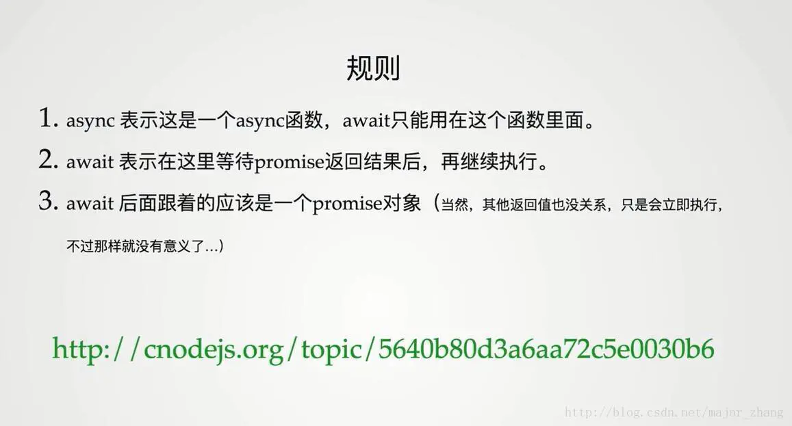
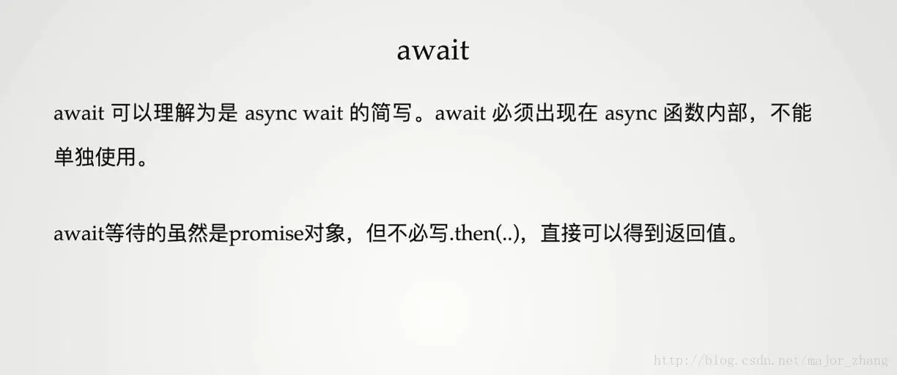

异步一般用来处理发送请求
处理发送请求的有Promise、Async。
### Promise 
Promise 一般用来处理异步请求回调，它是一个容器，里面保存着异步处理的结果。
基本语法是：
let p = new Promise((resolve,reject)=>{
  setTimeout(()=>{
     resolve('success');
    },500);
  reject('error');
})
p.then(result=>{
  console.log(result);
})
 Promise的出现是为了解决回调地狱的，什么叫回调地狱，回调地狱就是：在第一层请求成功后，里面又嵌套一层又一层的ajax请求（也就是在第一层请求成功后才能去请求别的数据，），这样的写出的代码会很难读懂。这才有了Promise。promise的特点是，第一个new 出来的实例.then返回的是一个Promise对象。且还有一个好处是：每一个请求的错误处理可以只有最后一次请求的错误处理。坏处是要不停的.then。
### async
  async是寄生于Promise,async放在一个函数前，用来声明该函数是异步的，里面用来发起请求和处理请求返回来的结果，返回值是一个Promise。
  还配套有一个await,该关键字用于async内部，被认为是async await,用来等待一个异步方法执行完成。需要注意的就是await是强制把异步变成了同步，这一句代码执行完，才会执行下一句。

